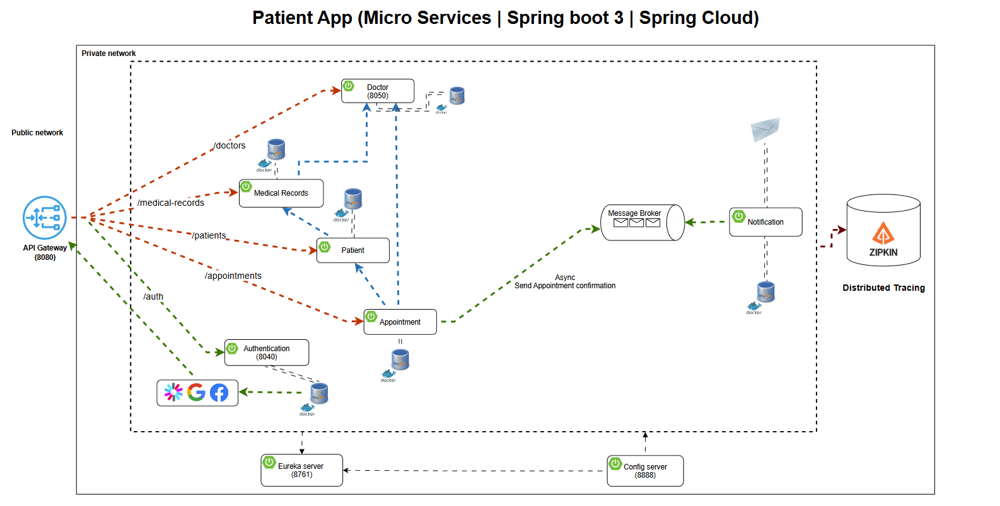

# ⚙️ Enterprise-Grade Patient Microservices Platform with Spring Boot

## 📌 Overview
This project is a **robust, scalable, and cloud-native Patient Management Platform** designed with a
modular **microservices architecture** using **Spring Boot**.
Each core domain (**Patient**, **Doctor**, **Appointment**, **Notification**, **Medical Record**) is developed as an independent,
decoupled service, enabling high flexibility, fault isolation, and seamless scaling.

The project includes a `docker-compose.yml` that orchestrates the domain services
for the Patient App (`Patient`, `Doctor`, `Appointment`, `Notification`, `Medical Record`, `Authentication`)
together with required infrastructure: `Kafka`, `Zookeeper`, `OAuth2.0` for authentication and authorization,
`Zipkin` for distributed tracing, and a relational database `MySQL`.
The composition targets local/development use and provides profiles to start only infrastructure or the full microservice ecosystem.

## 🛠️ Technologies Used
- **Spring Boot** (Microservices backend)
- **Spring Cloud** (Service discovery, config server, gateway)
- **MySQL** (Relational database)
- **MongoDB** (NoSQL database)
- **Kafka** (Event streaming)
- **Docker Compose** (Service orchestration)
- **Mongo Express** (MongoDB management)
- **Zipkin** (Distributed tracing)
- **Zookeeper** (Kafka coordination)
- **OAuth2.0** (Authentication & Authorization)

## 🖼️ Architecture Diagram

You can see the system architecture in the diagram below:



> **Note:** Each microservice (**Patient**, **Doctor**, **Appointment**, **Notification**, **Medical Record**, **Authentication**) uses its own dedicated database.
>
> All database and service-specific configurations are managed centrally through the **Spring Cloud Config Server**, allowing you to define and maintain each service’s settings (like environment variables and `application.yml` values) from a single location.

---

## 🚀 Getting Started

### 1️⃣ Prerequisites
Make sure you have installed:
- [Docker & Docker Compose](https://docs.docker.com/get-docker/)
- [Java 17+](https://adoptopenjdk.net/)
- [Maven](https://maven.apache.org/install.html)

### 2️⃣ Configure Environment Variables
Create a `.env` file in the repository root. Optionally create a service-specific `.env` inside each microservice to override configuration values.

For example, you can create `/services/appointment-service/.env.appointment` for the Appointment Service.

The next variables are required inside the root `.env` file:

```env
# MySQL
MYSQL_ROOT_PASSWORD=root123
MYSQL_USER=app_user
MYSQL_PASSWORD=app_pass

# MongoDB
MONGO_INITDB_ROOT_USERNAME=admin
MONGO_INITDB_ROOT_PASSWORD=pass

# ZOOKEEPER CONFIG
ZOOKEEPER_SERVER_ID=1

# KAFKA CONFIG
KAFKA_ADVERTISED_LISTENERS=PLAINTEXT://localhost:9092
KAFKA_PROCESS_ROLES=broker
KAFKA_CLUSTER_ID=1
KAFKA_NODE_ID=1
```

- Appointment Service:

```env.appointment
CONFIG_SERVER_URL=http://localhost:8888
DB_HOST=localhost
DB_NAME=appointment_db
DB_PORT=3307

DISCOVERY_SERVER_EUREKA_DEFAULT_ZONE=http://localhost:8761/eureka/
DISCOVERY_SERVER_HOSTNAME=localhost
DISCOVERY_SERVER_PORT=8761

APPOINTMENT_DB_PASSWORD=root123
APPOINTMENT_DB_USERNAME=root
APPOINTMENT_SERVER_PORT=8070
APPOINTMENT_SERVICE_URL=http://localhost:8070

FLYWAY_BASELINE_VERSION=0

JWT_SECRET_KEY=(your_jwt_secret_key) <- (REPLACE)

SERVER_CONTEXT_PATH=/api/v1

AUTH_SERVICE_URL=http://localhost:8040
DOCTOR_SERVICE_URL=http://localhost:8050
PATIENT_SERVICE_URL=http://localhost:8060

KAFKA_BOOTSTRAP_SERVERS=localhost:9092
```

- Authentication Service:

```env.auth
AUTH_DB_PASSWORD=root123
AUTH_DB_USERNAME=root
AUTH_SERVER_PORT=8040
AUTH_SERVICE_URL=http://localhost:8040

CONFIG_SERVER_URL=http://localhost:8888

DOCTOR_SERVICE_URL=http://localhost:8050
PATIENT_SERVICE_URL=http://localhost:8060

AUTH_SPRING_DATASOURCE_URL=jdbc:mysql://localhost:3307/auth_db?createDatabaseIfNotExist=true&serverTimezone=UTC
DB_HOST=localhost
DB_NAME=auth_db
DB_PORT=3307

DISCOVERY_SERVER_EUREKA_DEFAULT_ZONE=http://localhost:8761/eureka/
DISCOVERY_SERVER_HOSTNAME=localhost
DISCOVERY_SERVER_PORT=8761


FACEBOOK_CLIENT_ID=(your_facebook_client_id) <- (REPLACE)
FACEBOOK_CLIENT_SECRET=(your_facebook_client_secret) <- (REPLACE)

FLYWAY_BASELINE_VERSION=0

FRONT_END_DOMAIN=localhost
FRONT_END_URL=http://localhost:5173

GOOGLE_CLIENT_ID=(your_google_client_id) <- (REPLACE)
GOOGLE_CLIENT_SECRET=(your_google_client_secret) <- (REPLACE)
GOOGLE_REDIRECT_URI=http://localhost:8040/api/v1/login/oauth2/code/google

JWT_EXPIRATION=9000000
JWT_REFRESH_TOKEN_EXPIRATION=86400000
JWT_SECRET_KEY=(your_jwt_secret_key) <- (REPLACE)

SERVER_CONTEXT_PATH=/api/v1

KAFKA_BOOTSTRAP_SERVERS=localhost:9092

SUPERADMIN_EMAIL=email@example.com <- (REPLACE)
SUPERADMIN_PASSWORD=superadminpassword <- (REPLACE)
```

- Config Server:

```env.config
CONFIG_SERVER_PORT=8888

DISCOVERY_SERVER_EUREKA_DEFAULT_ZONE=http://localhost:8761/eureka/
DISCOVERY_SERVER_HOSTNAME=localhost
DISCOVERY_SERVER_PORT=8761
```

- Discovery Server:

```env.discovery
CONFIG_SERVER_URL=http://localhost:8888

DISCOVERY_SERVER_EUREKA_DEFAULT_ZONE=http://localhost:8761/eureka/
DISCOVERY_SERVER_HOSTNAME=localhost
DISCOVERY_SERVER_PORT=8761
```

- Doctor Service:

```env.doctor
CONFIG_SERVER_URL=http://localhost:8888
DB_HOST=localhost
DB_NAME=doctor_db
DB_PORT=3307

DISCOVERY_SERVER_EUREKA_DEFAULT_ZONE=http://localhost:8761/eureka/
DISCOVERY_SERVER_HOSTNAME=localhost
DISCOVERY_SERVER_PORT=8761

DOCTOR_DB_PASSWORD=root123
DOCTOR_DB_USERNAME=root
DOCTOR_SERVER_PORT=8050
DOCTOR_SERVICE_URL=http://localhost:8050

FLYWAY_BASELINE_VERSION=0

JWT_SECRET_KEY=(your_jwt_secret_key) <- (REPLACE)

SERVER_CONTEXT_PATH=/api/v1

AUTH_SERVICE_URL=http://localhost:8040
APPOINTMENT_SERVICE_URL=http://localhost:8070

KAFKA_BOOTSTRAP_SERVERS=localhost:9092
```

- Gateway Service:

```env.gateway
CONFIG_SERVER_URL=http://localhost:8888

DISCOVERY_SERVER_EUREKA_DEFAULT_ZONE=http://localhost:8761/eureka/
DISCOVERY_SERVER_HOSTNAME=localhost
DISCOVERY_SERVER_PORT=8761

FRONT_END_DOMAIN=localhost
FRONT_END_URL=http://localhost:5173

GATEWAY_SERVER_PORT=8080

JWT_SECRET_KEY=(your_jwt_secret_key) <- (REPLACE)
```

- Medical Record Service:

```env.medical-record
CONFIG_SERVER_URL=http://localhost:8888
DB_HOST=localhost
DB_NAME=medical_record_db
DB_PORT=3307

DISCOVERY_SERVER_EUREKA_DEFAULT_ZONE=http://localhost:8761/eureka/
DISCOVERY_SERVER_HOSTNAME=localhost
DISCOVERY_SERVER_PORT=8761

MEDICAL_RECORD_DB_PASSWORD=root123
MEDICAL_RECORD_DB_USERNAME=root
MEDICAL_RECORD_SERVER_PORT=8100
MEDICAL_RECORD_SERVICE_URL=http://localhost:8100

FLYWAY_BASELINE_VERSION=0

JWT_SECRET_KEY=(your_jwt_secret_key) <- (REPLACE)

SERVER_CONTEXT_PATH=/api/v1

AUTH_SERVICE_URL=http://localhost:8040
APPOINTMENT_SERVICE_URL=http://localhost:8070
DOCTOR_SERVICE_URL=http://localhost:8050
PATIENT_SERVICE_URL=http://localhost:8060

KAFKA_BOOTSTRAP_SERVERS=localhost:9092
```

- Notification Service:

```env.notification
CONFIG_SERVER_URL=http://localhost:8888

DISCOVERY_SERVER_EUREKA_DEFAULT_ZONE=http://localhost:8761/eureka/
DISCOVERY_SERVER_HOSTNAME=localhost
DISCOVERY_SERVER_PORT=8761

EMAIL=email@example.com <- (REPLACE with google/gmail account)
EMAIL_PASSWORD=emailpassword

KAFKA_BOOTSTRAP_SERVERS=localhost:9092

MAIL_HOST=smtp.gmail.com
MAIL_PORT=587

NOTIFICATION_SERVICE_MONGODB_AUTH_DB=admin
NOTIFICATION_SERVICE_MONGODB_DATABASE=notification
NOTIFICATION_SERVICE_MONGODB_HOST=localhost
NOTIFICATION_SERVICE_MONGODB_PASSWORD=pass
NOTIFICATION_SERVICE_MONGODB_PORT=27017
NOTIFICATION_SERVICE_MONGODB_USERNAME=admin
NOTIFICATION_SERVICE_SERVER_PORT=8090
```

- Patient Service:

```env.patient
CONFIG_SERVER_URL=http://localhost:8888
DB_HOST=localhost
DB_NAME=patient_db
DB_PORT=3307

DISCOVERY_SERVER_EUREKA_DEFAULT_ZONE=http://localhost:8761/eureka/
DISCOVERY_SERVER_HOSTNAME=localhost
DISCOVERY_SERVER_PORT=8761

PATIENT_DB_PASSWORD=root123
PATIENT_DB_USERNAME=root
PATIENT_SERVER_PORT=8060
PATIENT_SERVICE_URL=http://localhost:8060

FLYWAY_BASELINE_VERSION=0

JWT_SECRET_KEY=(your_jwt_secret_key) <- (REPLACE)

SERVER_CONTEXT_PATH=/api/v1

AUTH_SERVICE_URL=http://localhost:8040
```

### 3️⃣ Start All Services
Run the following command to start the entire stack:

```sh
docker-compose up -d
```

This will start:
- MySQL
- MongoDB & Mongo Express
- Kafka & Zookeeper
- Zipkin
- All microservices (start them individually with Maven as needed)

### 4️⃣ Set Environment Variables
Each microservice requires specific environment variables to be set. You can assign your own values or use the provided defaults in the `docker-compose.yml` file. For local development, create a `.env` file in each service directory or set the variables directly in your environment. Refer to each service's documentation for required variables.

Additionally, for each service, ensure you add the following configuration to the `application.yml` file:

```yaml
spring:
  application:
    name: <service-name>
  config:
    import: optional:configserver:${CONFIG_SERVER_URL}
```
Replace `<service-name>` with the actual name of the service (e.g., `appointment-service`, `auth-service`, etc.).

### 5️⃣ Access Services
- **API Gateway:** `http://localhost:8080`
- **Authentication Service (Auth):** `http://localhost:8040`
- **Appointment Service:** `http://localhost:8070`
- **Doctor Service:** `http://localhost:8050`
- **Patient Service:** `http://localhost:8060`
- **Medical Record Service:** `http://localhost:8100`
- **Notification Service:** `http://localhost:8090`
- **Config Server:** `http://localhost:8888`
- **Eureka Discovery Server:** `http://localhost:8761`
- **Mongo Express:** `http://localhost:8081`
- **Zipkin:** `http://localhost:9411`

Other infra endpoints (non-HTTP services):
- **Kafka broker (bootstrap):** `localhost:9092` (used by services as KAFKA_BOOTSTRAP_SERVERS)
- **MongoDB:** `mongodb://localhost:27017` (default used in examples)
- **MySQL (example DB port used in service samples):** `localhost:3307`

Notes:
- Ports above are taken from the example `.env` snippets in this README. If you override ports in your local `.env` or `docker-compose.yml`, use those values instead.
- Some services (Kafka, MySQL, MongoDB) are not HTTP services — connect with the appropriate client or driver using the host:port shown.

### 6️⃣ Stop All Services
To stop and remove all containers, run:
```sh
docker-compose down
```

---

## 🔒 Authentication & Security
The platform uses **OAuth2.0** for authentication and authorization, managed by the `Authentication Service`.
Configure clients and roles as needed for your application. Each microservice can be secured using OAuth2 and JWT tokens.

---

## 🛠️ Development
### Run a Microservice Locally (Without Docker)
1. Start the required infrastructure services (MySQL, MongoDB, Kafka, etc.) via Docker Compose.
2. Configure the microservice's `application.yml` with the correct connection settings.
3. In the service directory, run:
   ```sh
   mvn spring-boot:run
   ```
   if you use IntelliJ IDEA or another IDE, you can run the main class directly.
---

## 📜 License
This project is licensed under the [MIT License](LICENSE).

---

## 📩 Contact
For questions or contributions, please open an issue or submit a pull request!